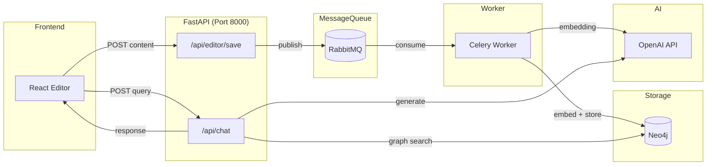

# Graph RAG 실시간 챗봇 서비스 구현

소설에서 사용자가 작성하는 데이터를 실시간으로 Graph RAG에 반영하여, 프로젝트(작품)별로 맞춤화된 AI 답변을 제공하는 Python-Native 챗봇 백엔드 서비스를 구현합니다.

## User Review Required

> [!IMPORTANT] > **인프라 의존성**: 이 서비스는 Neo4j와 RabbitMQ가 필요합니다. 기존에 사용 중인 Neo4j 인스턴스가 있으면 연결 정보를 공유해 주세요.

> [!WARNING] > **OpenAI API 키**: 임베딩과 챗봇 응답에 OpenAI API가 필요합니다. API 키 설정이 필요합니다.

---

## Architecture Overview



**데이터 흐름:**

1. **Editor Save**: 프론트엔드에서 글쓰기 → FastAPI → RabbitMQ → Celery Worker → Neo4j 저장
2. **Chat Query (SSE)**: 프론트엔드에서 질문 → FastAPI → Neo4j 검색 + OpenAI SSE 스트리밍 → 실시간 답변 반환

---

## Proposed Changes

### Core Application

#### [NEW] [main.py](file:///Users/dongha/jungle/sto-link-chat/app/main.py)

FastAPI 메인 애플리케이션 진입점

- CORS 설정 (프론트엔드 연동)
- 라우터 등록 (`/api/editor`, `/api/chat`)
- 헬스체크 엔드포인트

---

#### [NEW] [celery_app.py](file:///Users/dongha/jungle/sto-link-chat/app/celery_app.py)

Celery 워커 설정 및 임베딩 태스크 정의

- RabbitMQ 브로커 연결
- `embed_and_store_task`: 텍스트 임베딩 후 Neo4j 저장

---

### API Routers

#### [NEW] [editor.py](file:///Users/dongha/jungle/sto-link-chat/app/routers/editor.py)

에디터 저장 API 엔드포인트

- `POST /api/editor/save`: 콘텐츠 수신 → RabbitMQ 발행
- 비동기 처리로 즉시 응답

---

#### [NEW] [chat.py](file:///Users/dongha/jungle/sto-link-chat/app/routers/chat.py)

챗봇 대화 API 엔드포인트

- `POST /api/chat/stream`: 사용자 질문 → Graph RAG 검색 → OpenAI SSE 스트리밍 응답
- 프로젝트 ID 기반 컨텍스트 필터링
- Server-Sent Events(SSE) 방식으로 실시간 스트리밍

---

### Services

#### [NEW] [neo4j_service.py](file:///Users/dongha/jungle/sto-link-chat/app/services/neo4j_service.py)

Neo4j 그래프 데이터베이스 서비스

- 연결 관리 (싱글톤 드라이버)
- 문서 청크 저장 (노드 생성/업데이트)
- 유사도 검색 (벡터 인덱스 활용)
- 프로젝트별 데이터 격리

---

#### [NEW] [embedding_service.py](file:///Users/dongha/jungle/sto-link-chat/app/services/embedding_service.py)

OpenAI 임베딩 서비스

- `text-embedding-3-small` 모델 사용
- 텍스트 청킹 (500자 단위, 100자 오버랩)
- 배치 임베딩 처리

---

#### [NEW] [chat_service.py](file:///Users/dongha/jungle/sto-link-chat/app/services/chat_service.py)

챗봇 응답 생성 서비스

- Graph RAG 컨텍스트 조회
- 프롬프트 구성 (시스템 + 컨텍스트 + 사용자 질문)
- GPT-4o-mini SSE 스트리밍 응답 (async generator 패턴)
- 실시간 토큰 단위 스트리밍

---

### Data Models

#### [NEW] [schemas.py](file:///Users/dongha/jungle/sto-link-chat/app/models/schemas.py)

Pydantic 스키마 정의

- `EditorSaveRequest`: chunk_uuid, content, project_id, user_id
- `ChatRequest`: message, project_id, user_id, conversation_history
- `ChatResponse`: response, sources

---

### Configuration

#### [NEW] [config.py](file:///Users/dongha/jungle/sto-link-chat/app/config.py)

환경 설정 (Pydantic Settings)

- 환경변수 기반 설정 관리
- Neo4j, RabbitMQ, OpenAI 연결 정보

---

#### [NEW] [.env.example](file:///Users/dongha/jungle/sto-link-chat/.env.example)

환경변수 템플릿

- 모든 필수 설정값 문서화

---

### Infrastructure

#### [NEW] [docker-compose.yml](file:///Users/dongha/jungle/sto-link-chat/docker-compose.yml)

Docker Compose 구성

- `fastapi`: 메인 API 서버 (포트 8000)
- `celery-worker`: 백그라운드 임베딩 워커
- `rabbitmq`: 메시지 브로커 (포트 5672, 관리 UI 15672)
- `neo4j`: 그래프 DB (포트 7474, 7687)

---

#### [NEW] [Dockerfile](file:///Users/dongha/jungle/sto-link-chat/Dockerfile)

FastAPI 애플리케이션 Docker 이미지

---

#### [NEW] [requirements.txt](file:///Users/dongha/jungle/sto-link-chat/requirements.txt)

Python 의존성 목록

- fastapi, uvicorn, celery
- neo4j, openai, langchain
- pydantic-settings

---

## File Structure

```
sto-link-chat/
├── app/
│   ├── __init__.py
│   ├── main.py              # FastAPI 진입점
│   ├── celery_app.py        # Celery 설정 및 태스크
│   ├── config.py            # 환경 설정
│   ├── routers/
│   │   ├── __init__.py
│   │   ├── editor.py        # 에디터 저장 API
│   │   └── chat.py          # 챗봇 API
│   ├── services/
│   │   ├── __init__.py
│   │   ├── neo4j_service.py # Neo4j 연동
│   │   ├── embedding_service.py # OpenAI 임베딩
│   │   └── chat_service.py  # 챗봇 응답 생성
│   └── models/
│       ├── __init__.py
│       └── schemas.py       # Pydantic 스키마
├── tests/
│   ├── __init__.py
│   ├── test_editor.py
│   └── test_chat.py
├── docker-compose.yml
├── Dockerfile
├── requirements.txt
├── .env.example
└── README.md
```

---

## Verification Plan

### Automated Tests

**1. Docker 서비스 시작 확인**

```bash
cd /Users/dongha/jungle/sto-link-chat
docker-compose up -d
docker-compose ps  # 모든 서비스 healthy 상태 확인
```

**2. API 헬스체크**

```bash
curl http://localhost:8000/health
# Expected: {"status": "healthy"}
```

**3. 에디터 저장 API 테스트**

```bash
curl -X POST http://localhost:8000/api/editor/save \
  -H "Content-Type: application/json" \
  -d '{
    "chunk_uuid": "test-uuid-001",
    "content": "홍길동은 조선시대의 의적이다. 탐관오리를 징벌하고 가난한 백성을 도왔다.",
    "project_id": "project-001",
    "user_id": "user-001"
  }'
# Expected: {"status": "accepted", "task_id": "..."}
```

**4. Neo4j 데이터 확인**

```bash
# Neo4j Browser 접속: http://localhost:7474
# 쿼리 실행:
MATCH (c:Chunk {project_id: "project-001"}) RETURN c LIMIT 10
```

**5. 챗봇 API 테스트 (SSE 스트리밍)**

```bash
curl -N -X POST http://localhost:8000/api/chat/stream \
  -H "Content-Type: application/json" \
  -H "Accept: text/event-stream" \
  -d '{
    "message": "홍길동은 누구인가요?",
    "project_id": "project-001",
    "user_id": "user-001"
  }'
# Expected: SSE 스트리밍 형식으로 실시간 응답
# data: {"type": "token", "content": "홍"}
# data: {"type": "token", "content": "길"}
# data: {"type": "done", "sources": [...]}
```

### Manual Verification

1. **RabbitMQ 관리 UI 확인**

   - http://localhost:15672 접속 (guest/guest)
   - Queues 탭에서 메시지 처리 현황 확인

2. **Celery 워커 로그 확인**

   ```bash
   docker-compose logs -f celery-worker
   ```

   - 태스크 수신 및 처리 로그 확인

3. **프론트엔드 연동 테스트** (사용자 확인 필요)
   - 기존 StoLink 프론트엔드에서 에디터 저장 시 API 호출
   - 챗봇 UI에서 대화 테스트
